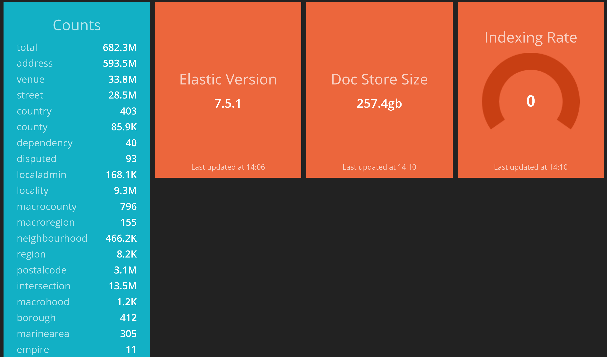

<p align="center">
  
</p>
<h3 align="center">A modular, open-source search engine for our world.</h3>
<p align="center">Pelias is a geocoder powered completely by open data, available freely to everyone.</p>
<p align="center">
<a href="https://en.wikipedia.org/wiki/MIT_License"></a>
<a href="https://hub.docker.com/u/pelias"></a>
<a href="https://gitter.im/pelias/pelias"></a>
</p>
<p align="center">
	<a href="https://github.com/pelias/docker">Local Installation</a> ·
        <a href="https://geocode.earth">Cloud Webservice</a> ·
	<a href="https://github.com/pelias/documentation">Documentation</a> ·
	<a href="https://gitter.im/pelias/pelias">Community Chat</a>
</p>
<details open>
<summary>What is Pelias?</summary>
<br />
Pelias is a search engine for places worldwide, powered by open data. It turns addresses and place names into geographic coordinates, and turns geographic coordinates into places and addresses. With Pelias, you’re able to turn your users’ place searches into actionable geodata and transform your geodata into real places.
<br /><br />
We think open data, open source, and open strategy win over proprietary solutions at any part of the stack and we want to ensure the services we offer are in line with that vision. We believe that an open geocoder improves over the long-term only if the community can incorporate truly representative local knowledge.
</details>

# Pelias Dashboard

This is a small, read-only dashboard that provides a convenient display of some basic information about Pelias based on data from Elasticsearch.

It's not a mission critical part of Pelias by any means, but it can be nice to look at.



This dashboard is built using the [Smashing](https://smashing.github.io/) framework.

## Basics

```
bundle install
ES_ENDPOINT=http://your_es_hostname_or_ip:9200/pelias smashing start
```

* navigate to http://localhost:3030 in your browser

Docker
------
There is an included Dockerfile that can be used to run the dashboard:

```
docker build . -t pelias/dashboard
docker run -it -e ES_ENDPOINT=http://your_es_hostname_or_ip:9200/pelias -p 3030:3030 -d --restart always --name pelias_dashboard pelias/dashboard
```

If running Pelias via [pelias/docker](https://github.com/pelias/docker/), you will want to ensure to set the correct network:

```
docker run -it --network pelias_default -e ES_ENDPOINT=http://elasticsearch:9200/ -p 3030:3030 -d --restart always --name pelias_dashboard pelias/dashboard
```
